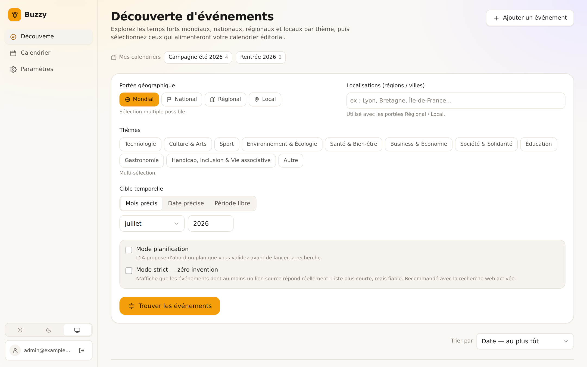

# 🐝 Buzzy



**Buzzy** est une application web *self-hosted* qui vous aide à :

1. **Découvrir des événements** mondiaux, nationaux, régionaux et locaux, classés par thème, générés par une IA que vous connectez dans les paramètres.
2. **Générer un calendrier éditorial** de publications (titre + description + hashtags) prêtes à être adaptées pour **Facebook, Instagram, LinkedIn, X et TikTok**, à partir de ces événements et de votre profil.

Optionnellement, Buzzy se branche à des **serveurs MCP de recherche web** pour fiabiliser les sources des événements générés. Trois d'entre eux sont livrés avec la stack, gratuits et sans clé API.

Conçue pour être déployée aux côtés d'autres applications self-hosted (Docker Compose / Coolify), Buzzy est totalement autonome : aucune dépendance à un service tiers, pas même pour les polices de caractères.

---

## 🚀 Démarrage

### Docker (recommandé)

Prérequis : Docker + Docker Compose.

```bash
git clone https://github.com/PetitOursManu/buzzy.git && cd buzzy
cp .env.example .env
# Éditez .env : changez au minimum JWT_SECRET, ENCRYPTION_KEY, ADMIN_PASSWORD
#   openssl rand -hex 32   ← pour générer chaque secret
docker compose up -d --build
```

L'application est disponible sur **http://localhost:3000**.

Au premier démarrage, l'entrypoint attend PostgreSQL, applique les migrations Prisma, puis le serveur crée le compte administrateur à partir de `ADMIN_EMAIL` / `ADMIN_PASSWORD` et pré-enregistre les serveurs MCP livrés (désactivés).

> Le serveur **refuse de démarrer en production** si `JWT_SECRET` ou `ENCRYPTION_KEY` valent encore leur valeur d'exemple : un secret par défaut laisse forger n'importe quelle session et déchiffrer la clé API stockée. Pour passer outre sur un déploiement volontairement non exposé : `BUZZY_ALLOW_WEAK_SECRETS=1`.

### Développement local

Prérequis : Node.js ≥ 20 et un PostgreSQL accessible.

```bash
npm install
npm run setup    # génère .env avec de vrais secrets, applique le schéma, crée l'admin
npm run dev
```

`npm run setup` est idempotent : relancé, il ne réécrit jamais un `.env` existant. Il affiche à la fin les identifiants de connexion. Si aucune base n'est joignable, il indique précisément comment en obtenir une.

- Backend : http://localhost:3000 (API sous `/api`)
- Frontend (Vite) : http://localhost:5173 (proxy `/api` → backend)

Besoin d'un PostgreSQL rapidement ?

```bash
docker run -d --name buzzy-db -p 5432:5432 \
  -e POSTGRES_USER=buzzy -e POSTGRES_PASSWORD=buzzy -e POSTGRES_DB=buzzy \
  postgres:16-alpine
```

| Commande | Rôle |
|---|---|
| `npm run setup` | Installation complète en une fois (`.env`, Prisma, schéma, admin) |
| `npm run dev` | Backend + frontend en parallèle |
| `npm run build` | Build de production des deux applications |
| `npm run typecheck` | Vérification TypeScript des deux workspaces |
| `npm run seed` | (Re)crée le compte admin et les serveurs MCP pré-enregistrés |
| `npm run prisma:studio` | Explorateur de base Prisma |

> `npm install` génère automatiquement le client Prisma (script `postinstall`). Sans lui, le backend ne compile pas — c'est la première chose qui manquait à l'installation.

### Déploiement Coolify

Buzzy est prêt pour **Coolify** via son `docker-compose.yml` (Coolify n'utilise que ce fichier, pas `docker-compose.override.yml`).

1. **Créez une ressource** : *New Resource → Docker Compose*, basée sur ce dépôt Git, fichier `docker-compose.yml`.
2. **Domaine** : le service `app` déclare la variable magique `SERVICE_FQDN_APP_3000`. Coolify génère un domaine et configure le reverse-proxy vers le port `3000` — aucun label à écrire, aucun port codé en dur.
3. **Variables d'environnement** (onglet *Environment Variables*), avec le bouton *Generate* pour les secrets :

   | Variable | Valeur |
   |---|---|
   | `JWT_SECRET` | secret aléatoire long |
   | `ENCRYPTION_KEY` | secret aléatoire (≥ 32 caractères) |
   | `POSTGRES_PASSWORD` | mot de passe Postgres |
   | `ADMIN_EMAIL` / `ADMIN_PASSWORD` | identifiants du compte admin |

   `DATABASE_URL` se déduit automatiquement des variables `POSTGRES_*` : ne définir que le mot de passe suffit, et les deux restent cohérents — cause n°1 des boucles de redémarrage.

4. **Déployez.** Le service `app` a un *healthcheck* (`/api/health`) : Coolify attend qu'il soit sain. Migrations et compte admin s'exécutent automatiquement. Le volume `buzzy_postgres_data` persiste la base.

> **Autre reverse-proxy ?** Le `docker-compose.yml` fournit des **labels Traefik commentés** (service `app`) : décommentez-les et adaptez le domaine.

---

## ✨ Fonctionnalités

### Découverte d'événements

- Filtres combinables : **portées multiples**, **plusieurs localisations**, thèmes multi-sélection avec **jusqu'à 2 thèmes prioritaires**, cible temporelle par mois / date / période. Les filtres sont **conservés d'une page à l'autre**.
- **Mode planification** : l'IA propose d'abord un plan d'approche que vous **validez** avant la génération réelle.
- **Descriptions par réseau** : pour chaque événement, une description prête à publier est générée **par réseau préféré**, en respectant son ton et sa longueur — avec compteur de caractères et copie directe.
- **Historique recherchable** : recherche plein texte sur le titre, la description, le thème et la localisation, avec chargement progressif.
- **Édition et suppression** d'un événement, unitairement ou en vidant l'historique. La suppression indique combien de publications perdent leur lien source.
- Saisie manuelle d'un événement, avec rattachement immédiat à un calendrier existant.

### Calendrier éditorial

- Répartition automatique des publications sur une plage de dates selon une fréquence (X/jour, X/semaine, X/mois).
- Vues **Mois / Semaine / Liste**, navigation entre périodes, journée du jour mise en évidence.
- **Workflow de statut** : `Brouillon → Validée → Publiée`, avec filtre par statut et code couleur sur chaque publication.
- Édition complète d'une publication : texte, hashtags, **date**, statut, **duplication** (autre réseau ou autre date) et régénération IA individuelle.
- Publications issues d'événements datés hors plage : signalées et replaçables depuis un encart dédié.
- Export **iCal (.ics)**, **CSV** et **JSON**. Le `.ics` s'importe dans Google Agenda, Outlook ou Apple Calendar.

### Paramètres

- **Diagnostic** : état de l'installation en un écran — fournisseur IA, modèle, clé déchiffrable, profil, réseaux, joignabilité de chaque serveur MCP actif. Répond à « qu'est-ce qu'il me reste à configurer ? ».
- Fournisseur IA compatible OpenAI, avec **préréglages** (OpenRouter, OpenAI, Mistral, Groq, Ollama), test de connexion, liste des modèles et détection de la prise en charge des outils.
- **Mode de réflexion** (reasoning effort), si le modèle le supporte.
- Profil & attentes, réseaux préférés, sources à privilégier.
- Serveurs de recherche web MCP, thème clair/sombre/système, changement de mot de passe.

### Sécurité

- Compte admin unique, JWT en cookie `httpOnly`, mot de passe hashé en **argon2id**.
- Clé API IA et en-têtes MCP chiffrés en base (**AES-256-GCM**).
- Validation **zod** sur toutes les routes, *rate limiting* sur les générations IA et la connexion.
- **Protection SSRF** : les URLs produites par le modèle sont résolues avant d'être suivies, et refusées si elles pointent vers une adresse loopback, privée, link-local ou CGNAT. Chaque saut de redirection est revalidé. Sans ce garde-fou, `http://db:5432` ou `http://169.254.169.254/` — joignables depuis le conteneur — auraient été atteignables depuis une réponse du LLM.
- Contrôle des secrets au démarrage : refus de démarrer en production avec les valeurs d'exemple.

### Interface

- Design system à jetons : deux thèmes conçus séparément (clair chaud, sombre profond), pas l'un inversé de l'autre.
- **Typographie système** : aucune police téléchargée depuis un CDN. Rendu immédiat, fonctionnement hors ligne, aucune fuite vers un tiers.
- Jeu d'icônes SVG au trait, en `currentColor` — les emoji rendaient différemment sur chaque système et ne suivaient pas le thème.
- Navigation latérale sur grand écran, en-tête repliable sur mobile ; interface responsive **entièrement en français**.
- Boîtes de confirmation intégrées au thème, notifications empilables, respect de `prefers-reduced-motion`.

---

## 🧱 Stack technique

| Couche | Technologies |
|---|---|
| Frontend | React 18, Vite, TypeScript, Tailwind CSS, Framer Motion, TanStack Query, React Router |
| Backend | Node.js 20, Express, TypeScript |
| Base de données | PostgreSQL 16, Prisma ORM |
| Auth | JWT (cookie httpOnly), argon2id |
| Validation | zod |
| Recherche web | SDK MCP officiel (`@modelcontextprotocol/sdk`), tool calling compatible OpenAI |
| Conteneurisation | Docker multi-stage + docker-compose |

Le projet est un **monorepo npm workspaces** :

```
buzzy/
├── apps/
│   ├── frontend/          # React + Vite + TS + Tailwind
│   │   └── src/
│   │       ├── components/ui/   # primitives du design system
│   │       ├── components/      # composants métier
│   │       ├── hooks/           # auth, thème, toasts, confirmation, sélection
│   │       ├── pages/           # Découverte, Calendrier, Paramètres, Login
│   │       └── theme/index.css  # jetons de design (clair + sombre)
│   └── backend/           # Express + TS + Prisma
│       └── src/
│           ├── lib/       # env, crypto, net-guard (SSRF), ics, csv, version
│           ├── routes/    # auth, settings, events, calendar, posts
│           └── services/  # ai-provider, mcp, event, calendar, source-check
├── scripts/setup.mjs      # installation en une commande
├── Dockerfile             # multi-stage (front + back → image Node)
├── docker-compose.yml     # app + db + 3 serveurs MCP
├── docker-entrypoint.sh   # migrations Prisma puis démarrage
└── .env.example
```

---

## 🔐 Variables d'environnement

| Variable | Description | Exemple |
|---|---|---|
| `DATABASE_URL` | URL de connexion PostgreSQL | `postgresql://buzzy:buzzy@db:5432/buzzy` |
| `POSTGRES_USER` / `POSTGRES_PASSWORD` / `POSTGRES_DB` | Identifiants du conteneur Postgres ; `DATABASE_URL` en découle | `buzzy` |
| `JWT_SECRET` | Secret de signature des JWT (≥ 32 caractères) | `openssl rand -hex 32` |
| `ENCRYPTION_KEY` | Clé AES-256-GCM des secrets en base. 32 octets : 32 caractères, hex 64, ou base64 | `openssl rand -hex 32` |
| `ADMIN_EMAIL` | Email du compte admin créé au 1er démarrage | `admin@example.com` |
| `ADMIN_PASSWORD` | Mot de passe admin (hashé en argon2id) | — |
| `PORT` | Port d'écoute du serveur | `3000` |
| `NODE_ENV` | Environnement | `production` |
| `CORS_ORIGIN` | (Optionnel) origine(s) autorisée(s) en dev | `http://localhost:5173` |
| `BUZZY_GENERATION_TIMEOUT_MS` | Budget total d'une génération (défaut 100 000) | `150000` |
| `AI_REQUEST_TIMEOUT_MS` | Délai d'un appel individuel au modèle (défaut 120 000) | `180000` |
| `MCP_TOOL_TIMEOUT_MS` | Délai d'un appel d'outil MCP (défaut 25 000) | `40000` |
| `SEARXNG_MCP_URL` | Serveur MCP de recherche pré-enregistré (vide = aucun) | `http://searxng-mcp:8000/mcp` |
| `MCP_FETCH_URL` | Serveur MCP de lecture de pages pré-enregistré | `http://mcp-fetch:8000/mcp` |
| `MCP_TIME_URL` | Serveur MCP de date pré-enregistré | `http://mcp-time:8000/mcp` |
| `SEARXNG_SECRET` | Secret interne de SearXNG | chaîne longue |
| `LOCAL_TIMEZONE` | Fuseau renvoyé par le serveur MCP Time | `Europe/Paris` |
| `BUZZY_ALLOW_WEAK_SECRETS` | Démarre malgré des secrets d'exemple (déconseillé) | `1` |

> ⚠️ La clé API du fournisseur IA n'est **jamais** renvoyée en clair au frontend ni loguée. Seuls un indicateur « clé configurée » et les 4 derniers caractères sont exposés. Si vous changez `ENCRYPTION_KEY` après avoir enregistré des secrets, ceux-ci deviennent indéchiffrables — l'onglet **Diagnostic** le signale explicitement.

> En développement, le fichier `.env` à la racine est chargé automatiquement. En conteneur, les variables déjà présentes dans l'environnement l'emportent toujours sur le fichier.

---

## 🌐 Routes API

| Méthode | Route | Description |
|---|---|---|
| GET | `/api/health` | Sonde de vitalité (publique) : statut, version, base de données |
| POST | `/api/auth/login` | Connexion, pose le cookie JWT httpOnly |
| POST | `/api/auth/logout` | Déconnexion |
| GET | `/api/auth/me` | Utilisateur courant |
| GET | `/api/settings/diagnostics` | État complet de l'installation |
| GET / PUT | `/api/settings/ai-provider` | Config IA (clé jamais renvoyée en clair) |
| POST | `/api/settings/ai-provider/list-models` | Teste la connexion et liste les modèles |
| GET / PUT | `/api/settings/profile` | Profil utilisateur |
| PUT | `/api/settings/password` | Change le mot de passe de l'admin |
| GET / POST | `/api/settings/mcp-servers` | Liste / ajoute un serveur MCP |
| PUT / DELETE | `/api/settings/mcp-servers/:id` | Modifie / supprime un serveur MCP |
| POST | `/api/settings/mcp-servers/:id/test` | Teste la connexion et liste les outils |
| POST | `/api/events/plan` | Mode planification : renvoie un plan à valider |
| POST | `/api/events/generate` | Génère de nouveaux événements via l'IA |
| GET | `/api/events` | Liste les événements (filtres + recherche `q`) |
| POST | `/api/events/manual` | Crée un événement à la main |
| PUT / DELETE | `/api/events/:id` | Modifie / supprime un événement |
| DELETE | `/api/events` | Vide l'historique (hors `exceptIds`) |
| POST | `/api/events/:id/rephrase` | Reformule titre et description |
| POST | `/api/calendar/generate` | Génère un calendrier éditorial complet |
| POST | `/api/calendar` | Crée un calendrier vide |
| GET | `/api/calendar` | Liste les calendriers |
| GET / PUT / DELETE | `/api/calendar/:id` | Récupère / modifie / supprime un calendrier |
| DELETE | `/api/calendar/:id/posts` | Vide un calendrier de ses publications |
| POST | `/api/calendar/:id/events` | Rattache un événement (une publication par réseau) |
| GET | `/api/calendar/:id/export` | Export `?format=json\|csv\|ics` |
| POST | `/api/posts` | Ajoute une publication à la main |
| PUT / DELETE | `/api/posts/:id` | Édite / supprime une publication |
| POST | `/api/posts/:id/duplicate` | Duplique une publication |
| POST | `/api/posts/:id/regenerate` | Régénère une publication via l'IA |

Toutes les routes hors `login` / `logout` / `health` exigent le cookie JWT. Un `401` sur une route authentifiée ramène automatiquement à l'écran de connexion.

---

## 🔎 Fiabilité des sources

Buzzy applique **trois garde-fous** contre les événements inventés :

1. **Prompts anti-invention** — le modèle est instruit de ne recenser que des événements réels : *« mieux vaut renvoyer peu d'événements, voire aucun, que d'en inventer un seul »*. Le nombre demandé est un **maximum**, jamais un objectif (c'est la pression du quota qui pousse un LLM à combler par de l'invention).
2. **Auto-déclaration de certitude** — chaque événement porte un champ `certainty` ; tout événement signalé « incertain » est **automatiquement écarté** côté serveur.
3. **Mode strict** (case à cocher sur la page Découverte) — seuls les événements dont **au moins un lien source répond réellement** sont conservés. Liste plus courte, mais fiable.

Par ailleurs, Buzzy **teste réellement chaque lien** avant de l'enregistrer — requête `HEAD` (puis `GET` si le serveur refuse `HEAD`), redirections suivies une par une, corps jamais téléchargé :

- **lien mort** (404/410, domaine inexistant, timeout) → **supprimé** automatiquement ;
- **redirection vers l'accueil** (la page précise n'existe pas) → conservé, signalé ;
- **site protégé anti-bot** (403/429) → conservé, non certifié ;
- **lien qui répond** → *Lien vérifié*.

Quand aucune source fiable ne subsiste, la carte l'indique clairement et propose un lien de recherche web.

> ⚠️ **Limite honnête** : sans recherche web, aucun modèle d'IA ne peut *garantir* de ne rien inventer — il écrit de mémoire, sans moyen de vérifier. Pour une fiabilité maximale, activez la **recherche web MCP** *et* le **mode strict**.

---

## 🌐 Recherche web MCP

Buzzy peut brancher un ou plusieurs **serveurs MCP (Model Context Protocol)** de recherche web. La fonctionnalité est **désactivée par défaut**.

### Serveurs livrés avec Buzzy (100 % gratuits, sans clé)

Trois serveurs auto-hébergés sont déployés par la stack et **pré-enregistrés automatiquement** (désactivés) ; activez-les d'un clic dans **Paramètres → Recherche web**. Ensemble, ils forment la chaîne *chercher → ouvrir → dater* qui élimine l'essentiel des inventions :

| Serveur | Rôle | Pourquoi c'est utile |
|---|---|---|
| **SearXNG** ([`searxng-mcp/`](searxng-mcp/Dockerfile)) | Recherche web méta-moteur | Trouve les événements réels et fournit de vraies URLs |
| **Fetch** ([`mcp-fetch/`](mcp-fetch/Dockerfile)) — *officiel MCP* | Ouvre une page et la convertit en markdown | **Le plus efficace contre les inventions** : le modèle *lit* la page pour confirmer que l'événement et sa date existent |
| **Time** ([`mcp-time/`](mcp-time/Dockerfile)) — *officiel MCP* | Date et heure réelles | Sans lui, le modèle raisonne depuis sa date d'entraînement et se trompe d'année ou d'édition |

Fetch et Time proviennent des [serveurs de référence officiels du projet MCP](https://github.com/modelcontextprotocol/servers) ; ils sont exposés en HTTP via *supergateway*.

### Serveurs externes pré-configurés (préréglages)

| Serveur MCP | Coût | Clé API | Point fort |
|---|---|---|---|
| **Brave Search MCP** | Gratuit avec limite, puis payant | Oui | Simple, bon pour la recherche web/actualités générale |
| **Tavily MCP** | Gratuit jusqu'à 1000 crédits/mois | Oui | Résultats structurés optimisés pour les IA |
| **Bright Data MCP** | Gratuit jusqu'à 5000 requêtes/mois | Oui | Le plus robuste (contourne les blocages) |

Vous pouvez ajouter **n'importe quel serveur MCP personnalisé** — la liste n'est pas fermée.

> Cette fonctionnalité nécessite un modèle IA **compatible tool calling**. Sinon, Buzzy revient automatiquement à une génération sans recherche web et l'indique dans l'interface.
>
> Pour rester simple et sûr en environnement conteneurisé, Buzzy ne se connecte qu'à des serveurs MCP exposés en **HTTP/SSE**. Aucun serveur MCP local n'est lancé en sous-processus (pas de stdio).
>
> **Pourquoi pas un profil Compose ?** Coolify injecte les variables d'environnement dans les conteneurs, mais ne les transmet pas à la commande `docker compose` : un `COMPOSE_PROFILES` défini dans son interface ne démarrerait jamais les services. Les services sont donc déclarés sans profil ; la recherche web reste inactive côté application tant qu'elle n'est pas activée dans les paramètres.
>
> Pour ne pas déployer SearXNG du tout : supprimez les services `searxng` / `searxng-mcp` du `docker-compose.yml` et laissez `SEARXNG_MCP_URL` vide.

---

## 🩺 Diagnostiquer une erreur de génération

Un **502** sur `/api/events/generate` ne signifie pas que Buzzy a planté : c'est le code renvoyé quand l'appel au **fournisseur IA** échoue. La cause exacte est toujours écrite dans les logs du serveur :

```bash
docker compose logs -f app | grep "génération d'événements"
```

| Message | Cause | Correctif |
|---|---|---|
| `Le modèle a répondu 401` | Clé API invalide ou expirée | Ressaisir la clé dans *Paramètres → Modèle IA* |
| `Le modèle a répondu 402 / 429` | Crédits épuisés ou quota atteint | Vérifier votre compte chez le fournisseur |
| `Le modèle a répondu 404` | Identifiant de modèle inexistant | *Tester la connexion* puis choisir dans la liste |
| `Connexion impossible au modèle IA` | URL de base injoignable | Vérifier l'URL (souvent `…/v1`) et le réseau du conteneur |
| `n'a pas répondu en moins de N s` | Modèle trop lent pour le délai | Modèle plus rapide, réflexion réduite, ou `AI_REQUEST_TIMEOUT_MS` plus élevé |
| `n'a pas renvoyé de réponse exploitable` | Le modèle n'a pas produit de JSON valide | Modèle plus capable, ou désactiver le mode de réflexion |

### 502 de Buzzy, ou 502 du reverse-proxy ?

C'est la distinction décisive, et la console du navigateur ne permet pas de la faire — les deux affichent `502 (Bad Gateway)`. Regardez la **notification dans l'interface** :

| Ce que vous voyez | Origine | Suite |
|---|---|---|
| Une phrase française détaillée | Buzzy | La cause est dans les logs, voir la table ci-dessus |
| Juste « Erreur 502 » | Votre reverse-proxy | Il a coupé avant que Buzzy réponde |

Un 502 du proxy ne laisse **aucune** trace dans `docker compose logs app` : la requête y est toujours en cours. C'est le signe le plus fiable.

**Régler le proxy.** Une génération avec recherche web enchaîne jusqu'à onze appels au modèle et plusieurs chargements de pages. Buzzy la borne à `BUZZY_GENERATION_TIMEOUT_MS` (100 s par défaut) ; votre proxy doit accorder davantage :

```
délai de lecture du reverse-proxy  >  BUZZY_GENERATION_TIMEOUT_MS
```

- **Coolify / Traefik** — ajoutez un label au service `app` :
  `traefik.http.serversTransport.buzzy.responseHeaderTimeout=180s`
- **nginx** — `proxy_read_timeout 180s;`
- **Caddy** — `reverse_proxy … { transport http { read_timeout 180s } }`

Puis vérifiez la durée réelle de vos générations, journalisée à chaque succès :

```
[events] modèle=… web=oui durée=47s/100s proposés=9 retenus=7 …
```

Si `durée` frôle le budget, augmentez `BUZZY_GENERATION_TIMEOUT_MS` **et** le délai du proxy, ou réduisez le nombre de serveurs MCP actifs.

L'onglet **Paramètres → Diagnostic** vérifie en un écran le fournisseur, le modèle, la clé et la joignabilité de chaque serveur MCP actif.

---

## 📝 Notes techniques & choix d'implémentation

- **Client IA agnostique** : Buzzy appelle directement `/chat/completions` et `/models` compatibles OpenAI (sans SDK propriétaire) pour tolérer OpenRouter, Ollama, OpenAI, Mistral, etc. Le parsing JSON est tolérant (extraction de l'objet JSON même si le modèle ajoute du texte). Les paramètres facultatifs refusés par un modèle (`temperature`, `reasoning_effort`, `response_format`) sont retirés et la requête rejouée, plutôt que de faire échouer toute la génération.
- **Migrations** : fournies dans `apps/backend/prisma/migrations`. En Docker, `docker-entrypoint.sh` exécute `prisma migrate deploy` avec ré-essais tant que la base n'est pas prête, et diagnostique les erreurs d'authentification au lieu de boucler.
- **Garde-fous génération** : la génération de calendrier est plafonnée (120 publications) ; le calcul des créneaux de repli est borné à 500 dates.
- **Servi en une seule image** : en production, Express sert l'API sous `/api` et le frontend buildé (fallback SPA) sur le port `3000`. Les assets hashés sont cachés un an, `index.html` jamais — sans quoi un déploiement continuerait de servir l'ancienne application.
- **Suppression d'événement** : la clé étrangère `Post.relatedEventId` est en `ON DELETE SET NULL`. Les publications survivent donc à la suppression de leur événement ; l'API renvoie le nombre de publications détachées et l'interface le rapporte.

---

## 🧭 Pistes d'évolution

- **Publication automatique** : connexion à un outil de programmation de posts (ex. **Postiz**).
- **Multi-utilisateurs & rôles**, gestion d'équipes.
- **Génération d'images** d'illustration par IA pour chaque publication.
- **Analytics** de performance des publications par réseau.
- **Nouveaux préréglages MCP**.

---

Buzzy 🐝 — *Fait bourdonner votre communication.*
